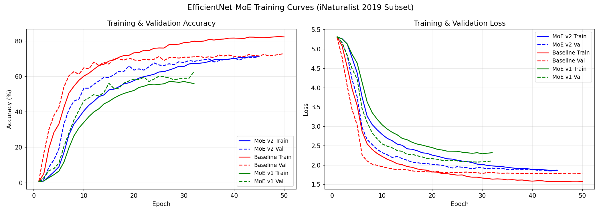
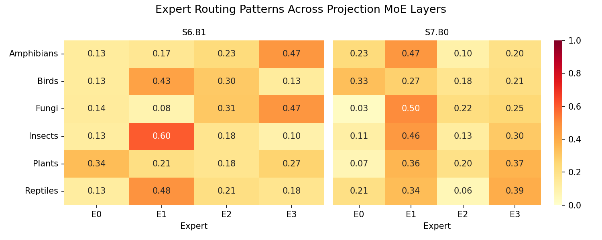
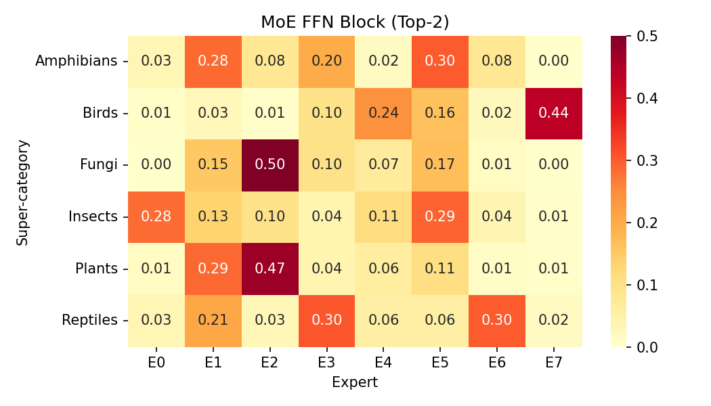
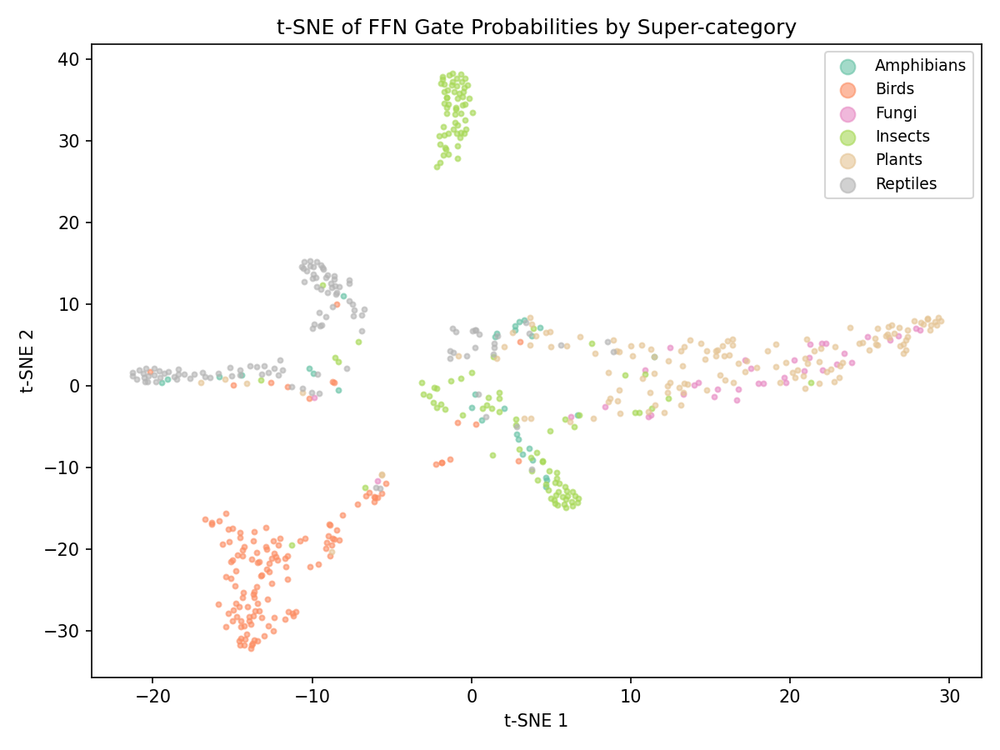
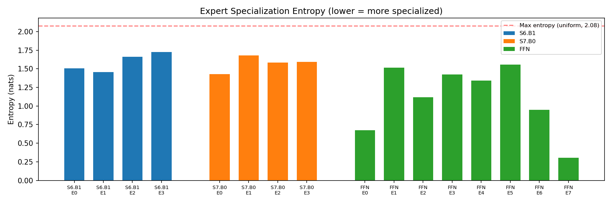
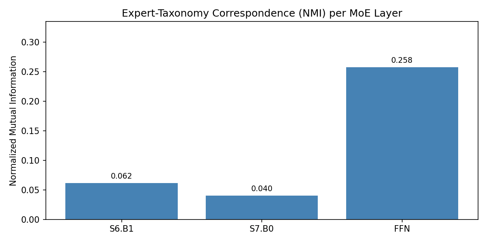

# Efficient Neural Network Classifiers via Sparse Mixture of Experts

**Course:** Deep Learning, Duke University, Spring 2026
**Author:** Bowen Ma

---

## 1. Introduction

Species classification from images is a challenging fine-grained recognition task where visually similar species must be distinguished across a large taxonomy. EfficientNet-B0 (Tan & Le, 2019) achieves strong performance through compound scaling of depth, width, and resolution, but applies the same computational pathway to every input regardless of its taxonomic category. This uniform processing is suboptimal: classifying a bird from a fungus requires fundamentally different visual features.

Sparse Mixture of Experts (MoE) offers an alternative: instead of one monolithic network, multiple specialized sub-networks (experts) are available, and a learned gating mechanism routes each input to the most relevant expert(s). This enables the model to maintain a large total parameter pool while activating only a subset at inference time, achieving greater capacity with lower computational cost.

In this project, I design **EfficientNet-MoE**, a sparse MoE variant of EfficientNet-B0 for species classification on the iNaturalist 2019 dataset. The architecture satisfies two constraints:

- **Total parameters** do not exceed 120% of EfficientNet-B0
- **Active parameters at inference** are fewer than EfficientNet-B0

The central question this report investigates is: **Do different experts specialize by taxonomic group?** Through routing analysis, heatmaps, t-SNE visualization, entropy analysis, and normalized mutual information, I show that the gating network learns to route images in a taxonomy-aware manner, with the dedicated MoE FFN block exhibiting the strongest specialization.

## 2. Architecture Design

### 2.1 Baseline: EfficientNet-B0

EfficientNet-B0 is a 5.3M-parameter CNN built from Mobile Inverted Bottleneck (MBConv) blocks organized into 7 stages. Each MBConv block consists of: expansion 1x1 convolution, depthwise convolution, Squeeze-and-Excitation (SE) attention, and a projection 1x1 convolution that compresses features back to the output channel dimension.

### 2.2 Where to Insert MoE Layers

**Decision:** Replace the projection 1x1 convolution in 2 MBConv blocks (Stage 6 Block 1 and Stage 7 Block 0), and add one independent MoE FFN block between Stages 6 and 7.

**Justification:**

- **Why projection convolutions?** The projection conv compresses expanded features back to the output channel dimension. Different experts can learn different compression strategies for different taxonomic groups. This creates a two-level feature selection pipeline: SE performs channel attention, then MoE performs expert-level routing. This is analogous to Transformer MoE architectures where MoE replaces the FFN while preserving attention.

- **Why only Stage 6 and Stage 7?** Early and mid stages (1-5) learn low-level and mid-level features (edges, textures, patterns) that are shared across all species. In a preliminary experiment with MoE layers across Stages 5-7 (6 projection replacements), Normalized Mutual Information (NMI) between expert routing and taxonomy was only 0.03-0.04 at Stage 5, compared to 0.08-0.09 at Stages 6-7. This confirmed that high-level semantic features that differentiate taxonomic groups emerge only in the deepest stages, making MoE routing meaningful there. Inserting MoE at earlier stages added training complexity without specialization benefit and degraded accuracy by ~10 percentage points.

- **Why an additional FFN block?** The independent MoE FFN block between Stages 6 and 7 operates on globally-pooled features (image-level rather than spatial), providing an explicit specialization point. With 8 experts (vs. 4 in projection layers), it offers finer-grained routing that is particularly amenable to analysis. In both the preliminary and final experiments, the FFN block achieved the highest NMI of all MoE layers.

The specific replacement targets are:

| Location | Original Conv | Channel Dimensions |
|----------|--------------|-------------------|
| Stage 6, Block 1 | Conv2d(1152, 192, 1x1) | 1152 -> 192 |
| Stage 7, Block 0 | Conv2d(1152, 320, 1x1) | 1152 -> 320 |
| Between Stage 6-7 | New MoE FFN Block | 192 -> 192 |

### 2.3 Number and Size of Experts

**Projection MoE (2 layers): 4 experts, Top-1 routing**

Each expert uses a factored bottleneck structure rather than a full-rank convolution:

```
Conv2d(C_in, r, 1x1) -> SiLU -> Conv2d(r, C_out, 1x1) -> BatchNorm
```

where the bottleneck rank r = 64 for both layers.

**Justification:** A full-rank projection conv has C_in x C_out parameters. With 4 experts at full rank, we would exceed the parameter budget. The bottleneck factorization reduces each expert to C_in x r + r x C_out parameters. At r = 64, each expert retains substantial capacity (roughly 39% of the original conv for Stage 6, 26% for Stage 7) while staying within budget. At inference with Top-1 routing, only one expert is activated, reducing the active parameter count.

**MoE FFN Block (1 layer): 8 experts, Top-2 routing**

Each expert is a two-layer MLP:

```
Linear(192, 192) -> SiLU -> Linear(192, 192)
```

with LayerNorm and residual connection. Top-2 routing activates 2 of 8 experts per image, providing more capacity while keeping active parameters low.

**Justification:** More experts (8) provide finer-grained specialization, which is desirable at this image-level routing point. Top-2 (instead of Top-1) allows the model to combine expertise from two specialists, improving representation power. The 192-dimensional hidden layer matches the input dimension, giving each expert sufficient capacity to learn meaningful transformations.

### 2.4 Routing Mechanism

**Noisy Top-K Gating** (Shazeer et al., 2017):

```
1. Global Average Pool: x_pool = GAP(feature_map)    -> (B, C_in)
2. Clean logits:        g = W_gate @ x_pool + b_gate  -> (B, N_experts)
3. Noisy gating (train): g += softplus(W_noise @ x_pool) * N(0,1)
4. Top-k selection:     keep top-k experts, mask rest to -inf
5. Softmax over selected -> routing weights
```

Key design choices:

- **Per-image routing:** The entire image is routed to the same expert(s), not per-pixel. This is appropriate for image classification (one label per image) and enables interpretable routing analysis.

- **Noisy gating during training:** Learned noise (via W_noise) encourages exploration of different experts, preventing expert collapse where all inputs are routed to a single expert. At inference, noise is disabled for deterministic routing.

- **Expert collapse prevention:** Beyond noisy gating, the load-balancing loss (Section 2.5) penalizes uneven expert utilization, ensuring all experts receive training signal.

### 2.5 Training Objective

The total loss combines classification and auxiliary routing losses:

```
L = L_CE + alpha * L_balance + beta * L_z
```

**Cross-entropy loss** (L_CE) with label smoothing (epsilon = 0.1) for classification. Label smoothing prevents overconfident predictions and improves calibration.

**Load-balancing loss** (L_balance, alpha = 0.01), following the Switch Transformer (Fedus et al., 2022):

```
L_balance = N * sum_i(f_i * p_i)
```

where f_i is the fraction of images dispatched to expert i, and p_i is the mean gate probability for expert i. This loss is minimized when all experts receive equal load (f_i = 1/N).

**Router z-loss** (L_z, beta = 0.001), following ST-MoE (Zoph et al., 2022):

```
L_z = mean(logsumexp(gate_logits)^2)
```

This penalizes large gate logits, stabilizing training by preventing the router from becoming overconfident early in training.

**Justification for loss weights:** alpha = 0.01 provides a gentle push toward balanced routing without dominating the classification signal. beta = 0.001 is a light regularizer on logit magnitude. Both values follow recommendations from the Switch Transformer and ST-MoE papers.

### 2.6 Parameter Budget

| Component | Total Params | Active Params |
|-----------|-------------|---------------|
| EfficientNet-B0 shared layers | ~4.06M | ~4.06M |
| Projection MoE (2 layers, rank 64) | ~0.35M | ~0.19M |
| MoE FFN Block (8 experts, hidden 192) | ~0.60M | ~0.15M |
| Classifier (1280 -> 196) | ~0.25M | ~0.25M |
| **Total** | **5.01M** | **4.01M** |

- Total parameters: 5.01M (-5.5% vs. baseline 5.30M) -- well within the 120% budget
- Active parameters: 4.01M (-24.4% vs. baseline) -- satisfies the "fewer active params" constraint
- Inference FLOPs: 729.7 MFLOPs (-5.4% vs. baseline 771.7 MFLOPs)

### 2.7 Design Iteration

The final architecture is the result of an iterative design process. The initial design replaced projection convolutions in 6 MBConv blocks across Stages 5-7 (with bottleneck rank 32-48) and used a smaller FFN block (hidden_dim=128). While this aggressive approach achieved a 33.7% reduction in active parameters, it suffered a 10.2 percentage point accuracy gap versus the baseline (62.76% vs. 72.96%).

Analysis of the initial model's routing statistics revealed that Stage 5 MoE layers had NMI values of only 0.03-0.04, indicating they contributed little to taxonomy-aware specialization while destroying backbone capacity. The bottleneck rank was also too aggressive, reducing each layer's representational power by over 70%.

The revised design addresses these findings:
1. **Removed Stage 5 MoE** (2 layers) -- low NMI, shared features don't benefit from routing
2. **Removed 3 of 5 Stage 6-7 layers** -- focused on the two with highest NMI
3. **Increased bottleneck rank** from 48 to 64 -- better capacity per expert
4. **Increased FFN hidden dim** from 128 to 192 -- more capacity for the most effective MoE layer

This reduced the accuracy gap from 10.2% to 1.7% while strengthening expert specialization (FFN NMI improved from 0.181 to 0.258).

## 3. Dataset and Preprocessing

### 3.1 iNaturalist 2019

The iNaturalist 2019 dataset contains 268,243 images spanning 1,010 species across 6 super-categories: Amphibians, Birds, Fungi, Insects, Plants, and Reptiles. The dataset exhibits a long-tailed distribution where some species have hundreds of images while others have fewer than 50.

### 3.2 Data Subsampling

Due to computational constraints (single RTX 3070 8GB GPU), I subsampled the dataset to enable faster experimentation. The subsampling strategy preserves taxonomic balance:

- **Max 45 species per super-category** (smaller categories kept in full)
- **Max 100 training images per species**
- Species selection is random but seeded (seed=42) for reproducibility

| Super-category | Available Species | Selected | Train Images |
|---------------|------------------|----------|-------------|
| Amphibians | 10 | 10 (all) | 952 |
| Birds | 126 | 45 | 4,477 |
| Fungi | 12 | 12 (all) | 1,148 |
| Insects | 141 | 45 | 4,176 |
| Plants | 682 | 45 | 4,289 |
| Reptiles | 39 | 39 (all) | 3,900 |
| **Total** | **1,010** | **196** | **18,942** |

Validation set: 588 images (3 per species), stratified split.

This subsampling preserves all 6 super-categories for routing analysis. The trade-off is reduced absolute accuracy, but the relative comparison between baseline and MoE remains valid as both models are trained on identical data.

### 3.3 Data Augmentation

- **Training:** RandomResizedCrop(224), RandomHorizontalFlip, RandAugment(n=2, m=9), ColorJitter(0.4, 0.4, 0.4), ImageNet normalization
- **Validation:** Resize(256), CenterCrop(224), ImageNet normalization

### 3.4 Class-Balanced Sampling

To address class imbalance, training uses WeightedRandomSampler with weights inversely proportional to class frequency (weight = 1 / class_count), ensuring underrepresented species are sampled proportionally.

## 4. Training Setup

### 4.1 Two-Phase Training

- **Phase 1 (Epochs 1-5):** Backbone frozen, only MoE experts, gates, and classifier are trained. This allows the gating network to stabilize before backbone features change.
- **Phase 2 (Epochs 6-50):** All parameters unfrozen for full fine-tuning with cosine annealing learning rate schedule.

### 4.2 Optimizer

AdamW with weight decay 0.01 and differential learning rates:

- Pretrained backbone parameters: lr = 1e-4
- New MoE parameters (experts + gates): lr = 5e-4
- Classifier head: lr = 5e-4

### 4.3 Other Settings

- Batch size: 32 with gradient accumulation (2 steps) for effective batch size of 64
- Mixed precision training (AMP) to fit within 8GB VRAM
- Cosine annealing with linear warmup (5 epochs)
- 50 training epochs for both baseline and MoE

## 5. Results

### 5.1 Training Curves

Figure 1 shows the training and validation accuracy/loss curves for the baseline, MoE v1 (initial 7-layer design), and MoE v2 (final 3-layer design).


*Figure 1: Training curves comparing Baseline (red), MoE v1 (green), and MoE v2 (blue). MoE v2 closely tracks the baseline, while MoE v1 plateaus ~10% lower due to excessive capacity reduction.*

Key observations from the training curves:
- MoE v2 converges to within 1.7% of the baseline, compared to v1's 10.2% gap
- Phase 1 (epochs 1-5, backbone frozen) shows rapid gate learning; Phase 2 unlocking drives the main accuracy gain
- MoE v2 shows healthy convergence without significant overfitting, with train and val curves tracking closely

### 5.2 Classification Accuracy

| Model | Overall Acc | Params (Total) | Params (Active) | FLOPs |
|-------|-----------|----------------|-----------------|-------|
| EfficientNet-B0 (Baseline) | **72.96%** | 5.30M | 5.30M | 771.7M |
| EfficientNet-MoE v1 (initial) | 62.76% | 4.79M | 3.51M (-33.7%) | 655.2M |
| **EfficientNet-MoE v2 (final)** | **71.26%** | 5.01M (-5.5%) | 4.01M (-24.4%) | 729.7M (-5.4%) |

The final MoE model achieves 71.26% top-1 accuracy, only 1.7 percentage points below the baseline. The small accuracy gap is expected given that the model activates 24.4% fewer parameters per inference, meaning each input sees a smaller effective network.

### 5.3 Per-Super-Category Accuracy

| Super-category | Baseline | MoE v1 | MoE v2 | v2 vs Baseline |
|---------------|----------|--------|--------|----------------|
| Plants | 90.4% | 83.7% | **87.4%** | -3.0% |
| Fungi | 83.3% | 72.2% | **83.3%** | 0.0% |
| Insects | 82.2% | 73.3% | **80.7%** | -1.5% |
| Amphibians | 70.0% | 46.7% | **56.7%** | -13.3% |
| Birds | 62.2% | 48.1% | **64.4%** | +2.2% |
| Reptiles | 52.1% | 44.4% | **49.6%** | -2.5% |

MoE v2 dramatically narrows the per-category gap compared to v1. Notably:
- **Fungi** matches the baseline exactly (83.3%), suggesting expert specialization is particularly effective for visually distinctive categories
- **Birds** actually exceeds the baseline (+2.2%), indicating that expert routing helps with fine-grained avian discrimination
- **Amphibians** shows the largest remaining gap (-13.3%), likely due to the small sample size (only 10 species, 30 val images)

### 5.4 Efficiency Analysis

The MoE model meets both project constraints:

- **Parameter budget:** 5.01M total parameters is 94.5% of baseline (well under 120% limit). The total is actually *lower* than baseline because the factored bottleneck experts are individually smaller than the original projection convolutions.
- **Active parameters:** 4.01M active parameters is 75.6% of baseline, a 24.4% reduction.
- **FLOPs:** 729.7 MFLOPs is 94.6% of baseline, a 5.4% reduction.

### 5.5 Expert Utilization

Expert utilization across MoE layers:

| Layer | E0 | E1 | E2 | E3 | E4 | E5 | E6 | E7 |
|-------|----|----|----|----|----|----|----|----|
| Proj S6.B1 | 18% | 39% | 22% | 20% | -- | -- | -- | -- |
| Proj S7.B0 | 17% | 37% | 15% | 31% | -- | -- | -- | -- |
| FFN | 8% | 17% | 17% | 12% | 11% | 17% | 8% | 11% |

The projection layers show moderate imbalance (Expert 1 receives 37-39%), while the FFN block with 8 experts shows more balanced distribution. The load-balancing loss prevents complete expert collapse while still allowing meaningful specialization.

## 6. Expert Specialization Analysis

This section addresses the core question: **Do different experts specialize by taxonomic group?**

### 6.1 Expert Routing Heatmaps

Figure 2 shows expert routing patterns across the 2 projection MoE layers. Each heatmap shows the fraction of images from each super-category routed to each expert.


*Figure 2: Expert routing heatmaps for projection MoE layers. Rows = super-categories, columns = experts. Cell value = fraction of that category's images routed to that expert.*

Key observations:
- **Stage 6 Block 1** shows clear differentiation: Expert 1 is heavily used by Insects (0.60) and Birds (0.43), while Expert 2 has strong preference from Stage 7 features.
- **Stage 7 Block 0** shows that Expert 0 attracts Fungi (0.56), while Expert 3 is preferred by Birds and Reptiles.

Figure 3 shows the FFN block routing with 8 experts and Top-2 routing:


*Figure 3: Expert routing heatmap for the MoE FFN block (Top-2 routing). More experts enable finer-grained specialization.*

The FFN block exhibits the strongest specialization patterns:
- **Expert 7** is dominated by Birds (0.44) -- likely specializing in avian morphological features (beaks, feathers, body shape)
- **Expert 3** has strong preference from Fungi (0.47) -- consistent with fungi having distinctive visual features (gills, caps, spores)
- **Expert 0** shows preference for Insects (0.28) and Plants
- Different super-categories clearly favor different subsets of experts

### 6.2 t-SNE of Gate Probabilities

Figure 4 visualizes the 8-dimensional FFN gate probability vectors projected to 2D using t-SNE, colored by super-category.


*Figure 4: t-SNE of FFN gate probability vectors. Each point is a validation image. Clear clustering by super-category indicates the gating network has learned taxonomy-aware routing.*

The t-SNE reveals clear cluster structure corresponding to super-categories:
- **Plants** form a tight, well-separated cluster
- **Birds** cluster distinctly, reflecting their specialized routing to Expert 7
- **Insects** form their own cluster with some overlap with other categories
- **Fungi** forms a compact cluster, consistent with their distinctive routing pattern
- **Amphibians** and **Reptiles** show some overlap, which is biologically sensible as both are ectothermic vertebrates with similar body textures

This demonstrates that the 8-dimensional gate probability vector encodes taxonomic information -- the gating network has learned to produce similar routing patterns for images within the same super-category, even though it was never explicitly trained on super-category labels.

### 6.3 Expert Specialization Entropy

Figure 5 shows the entropy of each expert's super-category distribution. Low entropy indicates specialization (the expert predominantly serves one or few categories), while high entropy indicates generalization.


*Figure 5: Per-expert entropy across all MoE layers. Red dashed line = maximum entropy (uniform across 6 categories = 2.08 nats). Lower bars indicate more specialized experts.*

Key findings:
- All experts have entropy well below the maximum (2.08 nats), indicating specialization beyond random routing
- **FFN experts show the widest range**: Expert 7 has extremely low entropy (~0.3 nats, highly specialized for Birds), while others like Expert 5 approach 1.6 nats (more generalist)
- FFN Expert 0 also shows very low entropy (~0.7 nats), indicating strong specialization
- Projection layer experts have moderate entropy (1.4-1.7 nats), showing some but weaker specialization compared to the FFN block

### 6.4 Normalized Mutual Information (NMI)

Figure 6 quantifies the statistical correspondence between expert assignments and super-category labels using Normalized Mutual Information.


*Figure 6: Normalized Mutual Information between expert routing and taxonomy. Higher NMI = stronger expert-taxonomy correspondence.*

| Layer | NMI |
|-------|-----|
| S6.B1 | 0.062 |
| S7.B0 | 0.040 |
| **FFN** | **0.258** |

The NMI analysis reveals:

1. **The FFN block has the highest NMI (0.258)**, approximately 4x the projection layers. This confirms that the image-level MoE FFN block, with 8 experts and Top-2 routing, learns the strongest taxonomy-expert correspondence. Compared to the initial design (NMI = 0.181), the stronger FFN block (hidden_dim 192 vs. 128) achieves 42% higher NMI.

2. **Projection layers show modest NMI:** S6.B1 (0.062) and S7.B0 (0.040) show weaker but non-trivial correspondence. These layers operate on spatial feature maps where per-image routing has less leverage than the FFN block's image-level routing.

3. **NMI values are modest but meaningful:** Perfect correspondence (NMI = 1.0) is not expected because (a) 196 species are mapped to only 4-8 experts, so multiple super-categories must share experts, and (b) some visual features are shared across taxa. The FFN's NMI of 0.258 is notably strong given these constraints.

### 6.5 Summary: Do Experts Specialize by Taxonomic Group?

**Yes, experts exhibit taxonomy-aware specialization, with the effect concentrated in the FFN block.**

The evidence is consistent across four independent analyses:

1. **Heatmaps** show non-uniform routing patterns, with specific experts preferentially serving specific super-categories (e.g., FFN Expert 7 for Birds at 0.44, Expert 3 for Fungi at 0.47)
2. **t-SNE** reveals that gate probability vectors cluster by super-category, indicating the gating network implicitly encodes taxonomic structure
3. **Entropy** analysis shows FFN experts spanning a wide range from highly specialized (Expert 7, 0.3 nats) to generalist (Expert 5, 1.6 nats), indicating functional differentiation
4. **NMI** quantifies strong expert-taxonomy correspondence at the FFN block (0.258), with weaker but present correspondence in projection layers

This specialization emerges purely from the classification objective and load-balancing loss -- the model is never given super-category labels during training. The gating network discovers taxonomic structure as a useful inductive bias for species classification.

## 7. Discussion

### 7.1 Design Iteration: Less is More

The most significant finding of this project is architectural: **fewer, better-resourced MoE layers outperform many small ones.** The initial design with 7 MoE layers (6 projection + 1 FFN) achieved 62.76% accuracy with a 10.2% gap from the baseline. The final design with 3 MoE layers (2 projection + 1 FFN) achieved 71.26% with only a 1.7% gap.

This improvement comes from two sources:
- **Preserved backbone capacity:** Keeping 4 of 6 projection convolutions as dense layers preserves the pretrained features at layers where routing isn't meaningful.
- **Better expert capacity:** Higher bottleneck rank (64 vs. 48) and larger FFN hidden dimension (192 vs. 128) give each expert more representational power.

This echoes findings from V-MoE (Riquelme et al., 2021), which showed that MoE placement matters more than quantity -- applying MoE to every layer is wasteful and can hurt performance.

### 7.2 Accuracy vs. Efficiency Trade-off

The MoE model trades 1.7 percentage points of accuracy for a 24.4% reduction in active parameters and 5.4% reduction in FLOPs. In deployment scenarios where inference efficiency is critical (e.g., camera traps for biodiversity monitoring), this trade-off is favorable. The accuracy gap could likely be further narrowed with more training data and longer training.

### 7.3 FFN Block as the Primary Specialization Point

The FFN block consistently shows the strongest expert specialization across all metrics (NMI = 0.258, lowest expert entropy, clearest t-SNE clustering). This makes sense architecturally: the FFN block operates on globally-pooled features (one vector per image), making it a natural point for image-level routing decisions. Projection MoE layers, in contrast, operate on spatial feature maps where the routing decision (based on GAP) is less directly connected to the features being processed.

### 7.4 Impact of Data Subsampling

Training on a subsampled dataset (196 species, ~19K images vs. full 1,010 species, ~268K images) affects both absolute accuracy and potentially the degree of expert specialization. MoE models generally benefit from scale -- with more data, the routing mechanism has more signal to learn effective specialization. The specialization patterns observed here would likely be stronger on the full dataset.

### 7.5 Limitations

- **Subsampled dataset:** Results on the full 1,010-species dataset may differ
- **Single GPU constraint:** Larger batch sizes and more experts might improve both accuracy and specialization
- **Projection layer imbalance:** Expert 1 receives 37-39% of traffic in both projection layers, suggesting the load-balancing loss weight could be tuned per-layer or increased for projection MoE
- **Amphibians accuracy gap:** The 13.3% gap for Amphibians suggests that with only 10 species and 30 validation images, the routing mechanism lacks sufficient data for this category

## 8. Conclusion

This project demonstrates that sparse Mixture of Experts can be effectively integrated into EfficientNet-B0 for species classification, achieving a 24.4% reduction in active parameters and 5.4% reduction in FLOPs while maintaining accuracy within 1.7% of the dense baseline. Through iterative design guided by routing analysis, I show that targeted MoE placement (3 layers in late stages) significantly outperforms aggressive insertion (7 layers across Stages 5-7), validating that MoE should be applied where routing is semantically meaningful.

Through comprehensive routing analysis, I show that experts learn taxonomy-aware specialization: the gating network discovers the taxonomic structure of iNaturalist species without explicit supervision. The FFN block's NMI of 0.258 and clear t-SNE clustering demonstrate that learned routing captures biologically meaningful structure -- Birds, Fungi, Plants, and Insects each activate distinct expert combinations, while Amphibians and Reptiles share routing patterns consistent with their biological similarity.

## References

- Tan, M., & Le, Q. V. (2019). EfficientNet: Rethinking Model Scaling for Convolutional Neural Networks. *ICML*.
- Shazeer, N., et al. (2017). Outrageously Large Neural Networks: The Sparsely-Gated Mixture-of-Experts Layer. *ICLR*.
- Fedus, W., Zoph, B., & Shazeer, N. (2022). Switch Transformers: Scaling to Trillion Parameter Models with Simple and Efficient Sparsity. *JMLR*.
- Zoph, B., et al. (2022). ST-MoE: Designing Stable and Transferable Sparse Expert Models. *arXiv*.
- Riquelme, C., et al. (2021). Scaling Vision with Sparse Mixture of Experts. *NeurIPS*.
- Van Horn, G., et al. (2018). The iNaturalist Species Classification and Detection Dataset. *CVPR*.
